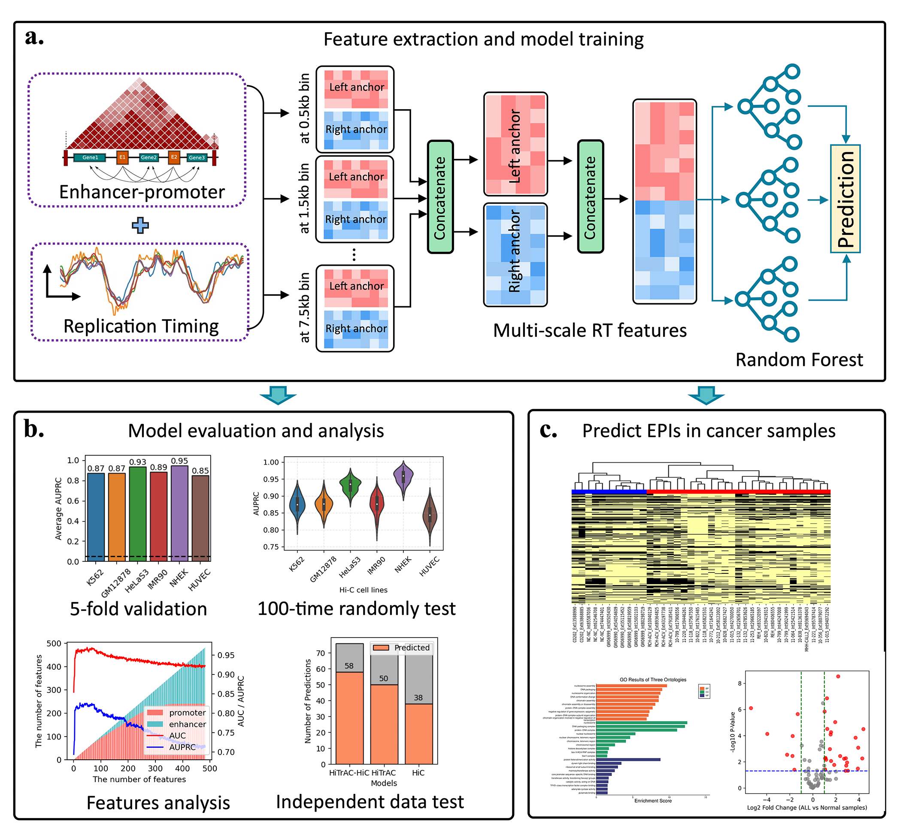

# RepliChrom

**Overview**

We developed a computational approach, named RepliChrom, to predict enhancer-promoter interactions (EPIs) using DNA replication timing (RT) signals.

**Systems Requirements**

The scripts were written in R and Python language.

To run the scripts, you need several R and Python packages. To install the packages:
`install.packages(c("pROC","glmnet","ranger","Matrix","ROCR"))` \
`source("https://bioconductor.org/biocLite.R")` \
`biocLite("BSgenome.Hsapiens.UCSC.hg19")` \
`biocLite("BSgenome.Hsapiens.UCSC.hg19.masked")` \
`biocLite("JASPAR2018")` \
`biocLite("TFBSTools")` 

**Script usage**

